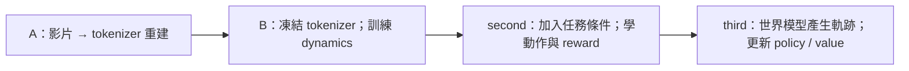

# Dreamer 4 論文原文核對：tokenizer 與訓練方法

本筆記保存改版前 commit `6f12c6b` 的研究與診斷。後續已依使用者要求實作縮小版時空 Transformer；目前架構、參數與 12GB 顯存檢查見[訓練說明](../training.md)。下文的舊實作差異保留作為修改依據。

核對日期：2026-09-26。來源是 Hafner、Yan、Lillicrap 的 [*Training Agents Inside of Scalable World Models*，arXiv:2509.24527v1](https://arxiv.org/abs/2509.24527v1)，2025-09-29 提交。以下頁碼指 [32 頁 PDF](https://arxiv.org/pdf/2509.24527v1) 的印刷頁碼。本機副本在 [papers/Training Agents Inside of Scalable World Models.pdf](../../papers/Training%20Agents%20Inside%20of%20Scalable%20World%20Models.pdf)，並已核對架構圖與附錄 A 的頁面影像。作者[專案頁](https://danijar.com/project/dreamer4/)提供影片與論文連結，沒有補足下列未報告的訓練超參數。以下分開記錄論文事實、repo 實作與推論。

## 先確認的結論

- 固定 `mask_ratio=0` **不是論文的 tokenizer 訓練配方**。作者對每張輸入影像抽 `p ~ U(0, 0.9)`，以機率 `p` 用可學習 embedding 取代各 patch；零遮罩用於推論，訓練中也會遇到完整可見的情況。[§3.1，式 (5)，第 5 頁](https://arxiv.org/pdf/2509.24527v1#page=5)
- tokenizer 的 encoder **和 decoder 都具時間因果性**，共用論文 §3.4 所述的時空 transformer 設計。decoder 不是只對當幀 latent 做一次淺層 cross-attention 的結構。作者安排每四層一次時間注意力，其餘為空間注意力；圖 2 直接畫出 block-causal encoder 與 decoder。[圖 2，第 4 頁](https://arxiv.org/pdf/2509.24527v1#page=4)；[§3.1，第 5 頁](https://arxiv.org/pdf/2509.24527v1#page=5)；[§3.4，第 8 頁](https://arxiv.org/pdf/2509.24527v1#page=8)
- tokenizer 重建目標是 MSE 加 `0.2 × LPIPS`，並對 loss 項使用 running RMS 正規化。論文沒有指定 LPIPS backbone、輸入值域、逐幀彙總細節、optimizer、學習率或 tokenizer 的總更新步數；不能把某個第三方實作的選擇稱為官方配方。[§3.1，式 (5)，第 5 頁](https://arxiv.org/pdf/2509.24527v1#page=5)；[§3，第 4 頁](https://arxiv.org/pdf/2509.24527v1#page=4)

## tokenizer 的資料流與注意力

每個時間步有當前影像的 patch tokens 和可學習 latent tokens。encoder 後，從 latent tokens 讀出，先線性投影至較小的通道數，再過 `tanh`，形成連續 bottleneck。decoder 把 bottleneck 投影回模型維度，與用來讀出 patch 的可學習 tokens 串接，再重建影像。encoder 內 latent 可注意所有模態，而個別模態僅能注意自己；decoder 則讓每個輸出模態注意自己與 latent，latent 僅注意自己。[§3.1，第 5 頁](https://arxiv.org/pdf/2509.24527v1#page=5)

作者說 encoder 和 decoder 都沿時間因果運作，以壓縮時間資訊並逐幀解碼。共用的 §3.4 架構是二維時空 transformer：時間上 block causal，同一幀內 tokens 能互相注意；把空間注意力和時間注意力拆成不同層，時間注意力每四層一次。基本 block 採 pre-layer RMSNorm、RoPE、SwiGLU，並用 QKNorm 和 attention-logit soft capping 穩定訓練。GQA 的明確敘述是「用於 dynamics 的所有注意力層」，**不能據此斷定 tokenizer 也使用 GQA**。[§3.4，第 8 頁](https://arxiv.org/pdf/2509.24527v1#page=8)

遮罩施加在 **encoder 輸入 patch**，是用 learned embedding 取代，不是把 token 刪掉。`p` 對不同影像重新抽樣，範圍 `0` 到 `0.9`；式 (5) 仍是影像重建損失。正文沒有說 MSE 或 LPIPS 只計算被遮住的區域，也沒有給出其他額外遮罩加權。作者明說 MAE 訓練改善由 dynamics 生成影片的空間一致性；沒有提供「固定零遮罩」或「單獨移除 MAE」的 tokenizer collapse 消融數字。[§3.1，第 5 頁](https://arxiv.org/pdf/2509.24527v1#page=5)

## 尺寸、容量與算力

| 論文可確認項目 | Minecraft 設定 | 出處 |
| --- | --- | --- |
| 影像、patch | 原始 `360 × 640`，補零至 `384 × 640`；`16 × 16` patch，故每幀 `24 × 40 = 960` 個影像 tokens | [附錄 A，第 25 頁](https://arxiv.org/pdf/2509.24527v1#page=25) |
| tokenizer bottleneck | `N_b=512` 個 latent，每個 `D_b=16` 維 | [附錄 A，第 25 頁](https://arxiv.org/pdf/2509.24527v1#page=25) |
| dynamics 輸入 | 把 bottleneck 的 `512 × 16` reshape 成 `N_z=256` 個、每個 `32` 維的 spatial tokens | [附錄 A，第 25 頁](https://arxiv.org/pdf/2509.24527v1#page=25) |
| dynamics 時長 | context `C=192` 幀；交替 batch 長度 `T₁=64`、`T₂=256` 幀；資料為 `20 FPS` | [附錄 A，第 25 頁](https://arxiv.org/pdf/2509.24527v1#page=25) |
| 參數與訓練硬體 | 共 `2B` 參數，tokenizer `400M`、dynamics `1.6B`；`256–1024` 顆 TPU-v5p，逐裝置 batch size 1，FSDP sharding | [§4，第 9 頁](https://arxiv.org/pdf/2509.24527v1#page=9) |

以上是**論文大型實驗的尺寸**，不是小模型所需的最低門檻。`960` 是輸入影像 patch 數，`512` 是 tokenizer bottleneck tokens，`256` 是 dynamics spatial tokens，三者不能混作同一個數。[附錄 A，第 25 頁](https://arxiv.org/pdf/2509.24527v1#page=25)

## 目標、階段與訓練時序

1. **世界模型預訓練。** 先以式 (5) 的 MSE + `0.2 LPIPS` 訓練 tokenizer，再用凍結的 tokenizer 表徵訓練 dynamics，目標為式 (7) 的 shortcut forcing；影片可選擇搭配 actions。dynamics 預測乾淨表徵，式 (8) 的 ramp loss weight 是 `0.9τ + 0.1`。推論每幀用 `K=4` 步。原文列歷史輸入 signal level `τ_ctx=0.1`，但它與文中的「輕微擾動」描述有歧義，見下文。[演算法 1，第 4 頁](https://arxiv.org/pdf/2509.24527v1#page=4)；[§3.1–3.2，第 5–6 頁](https://arxiv.org/pdf/2509.24527v1#page=5)
2. **Agent finetuning。** 在 dynamics 加入帶 task embedding 的 agent tokens，訓練 policy/reward heads。保留 noisy representation 和影片預測 loss，另加式 (9) 長度 `L=8` 的 multi-token action/reward 預測。Minecraft 以 `50%` uniform 與 `50%` 完成指定任務的 relevant 片段混合；BC loss 只用 relevant，dynamics loss 只用 uniform。這是 agent 階段的採樣規則，不可回推成 tokenizer 階段的規則。[§3.3，第 6–7 頁](https://arxiv.org/pdf/2509.24527v1#page=6)；[§4.1，第 10 頁](https://arxiv.org/pdf/2509.24527v1#page=10)
3. **Imagination training。** 用世界模型和 policy 產生 imagined trajectories，只更新 policy/value heads，凍結 transformer；value 用式 (10) 的 λ-return，policy 用式 (11) 的 PMPO 與凍結的 BC prior。論文註腳說更新整個 transformer 能有小幅額外收益，但須持續維持 dynamics、prior 與 reward losses，代價更高。[演算法 1，第 4 頁](https://arxiv.org/pdf/2509.24527v1#page=4)；[§3.3，第 7–8 頁](https://arxiv.org/pdf/2509.24527v1#page=7)

§3.4 說 dynamics 訓練交替使用大量短片段與偶爾長片段，最後只用長片段微調；並強調 batch 長度要超過 context 長度，以免模型過度依賴序列開頭。此處和附錄 A 的 Minecraft 數字有表面張力：`T₁=64 < C=192`，僅 `T₂=256 > C`。論文沒有進一步解釋短批次如何滿足那句通則，不能自行補一套機制。附錄也**沒有**短長 batch 的抽樣頻率、各段更新步數或 tokenizer 總訓練步數。[§3.4，第 8 頁](https://arxiv.org/pdf/2509.24527v1#page=8)；[附錄 A，第 25 頁](https://arxiv.org/pdf/2509.24527v1#page=25)

## 對重建失敗的證據界線

論文的 [表 2，第 15 頁](https://arxiv.org/pdf/2509.24527v1#page=15) 是**dynamics 設計**的逐項消融，指標為生成影片 FVD、訓練單步時間與推論 FPS。它展示 shortcut、x-space prediction/loss、ramp weight、交替 batch 長度、稀疏時間注意力與更多 spatial tokens 的影響；每個候選模型訓練 48 小時後評測。它沒有 tokenizer 重建品質、LPIPS 權重或 masking 比率的逐項消融，亦不能用來判定某一次重建坍塌的單一根因。[§4.4、表 2，第 15–16 頁](https://arxiv.org/pdf/2509.24527v1#page=15)

**推論，供實作檢查用。** 若某實作採固定零遮罩、沒有 decoder 的時間注意力、只用淺層 cross-attention，或完全省略 LPIPS，就偏離論文描述；這些差異值得先核對，但論文並未證明其中任一項必然造成該實作的重建坍塌。還要核實 loss 計算範圍、影像值域、patch 還原與梯度流，這些是一般重建程式的檢查點，**不是論文明定的失敗診斷**。

## 原文沒有提供的精度

arXiv v1 正文與附錄 A–I 沒有 tokenizer 專用 hyperparameter 表，也未列 optimizer 名稱與參數、學習率與衰減、warmup、梯度裁剪、encoder/decoder 層數與模型寬度、各 phase 更新步數、LPIPS backbone 和輸入值域。running RMS 的衰減率、初始化、epsilon 與統計粒度也沒有交代。正文提供模型總參數量與硬體規模，不能從這些數字反推出上述設定。[完整 arXiv v1 PDF](https://arxiv.org/pdf/2509.24527v1)

§3.2 的歷史輸入擾動另有未釐清之處：式 (6) 定義 `z_tau = (1 - tau) * noise + tau * clean`，但推論段將 `tau_ctx=0.1` 描述為輕微擾動；按式 (6) 代入卻是 `0.9 * noise + 0.1 * clean`。本 repo 目前按數值與公式實作。這是原文敘述與公式的疑點，不能自行斷定作者要的是 `0.9`，也不能把目前實作稱作「僅 10% noise」。B 階段前應取得澄清或用明確標示的消融驗證。[§3.2，式 (6)，第 6 頁](https://arxiv.org/pdf/2509.24527v1#page=6)

## 與目前實作逐項對照

以下以 commit `6f12c6b` 為準。這次只核對程式與既有紀錄，沒有訓練、修改設定或重新核對資料集。

repo 的 `A` 和 `B` 分別是論文 **Phase 1 的兩個子步驟**；`second` 對應 Phase 2；`third` 對應 Phase 3。

### A 階段最直接的差異

| 項目 | 論文明定做法 | 本 repo 的實作 | 判讀 |
| --- | --- | --- | --- |
| Encoder | patch 與 latent tokens 經多層時空 transformer；依模態限制注意力 | 一次 latent→patch cross-attention，接 4 層僅沿時間的 transformer | 改變了網路拓撲，不只是縮小寬度；沒有反覆處理空間特徵的 blocks |
| Decoder | latent 與 patch readout tokens 經因果時空 transformer | 當幀 patch queries 對 latents 做一次 cross-attention，再線性投影、sigmoid | 沒有 decoder 自己的時間注意力，也沒有 patch↔patch 空間 blocks；雖仍不看未來，結構並不同於論文 |
| Transformer block | RMSNorm、RoPE、SwiGLU、QKNorm、logit soft cap | LayerNorm、GELU、一般 MultiheadAttention；encoder patch 使用 learned position | 省略了論文明列的結構與穩定訓練機制 |
| 重建 loss | RMS 正規化後的 MSE 與 `0.2 LPIPS` | 直接加總原始尺度的 MSE 與 `0.2 LPIPS` | 同為 `0.2` 不代表實際權重等效；目前完全沒有 running RMS 狀態 |
| Masking | 每張圖抽 `p ~ U(0,0.9)` | 模型支援此抽樣，但新 `training_config.py` 的 A 將上限改成 `0` | 新設定是尚未驗證的消融，不能稱為論文配方，也不是既有 756 次訓練結果的成因 |
| 影像 patch | 補零至 `384×640`，patch 16，共 960 個 | 保留 `360×640`，patch 20，共 576 個 | repo 的原始解析度、不補邊契約與論文不同；要改需一併處理模型視圖契約 |
| Bottleneck | `512×16=8192` 個連續值，重排為 dynamics 的 `256×32` | `64×32=2048` 個連續值，直接給 dynamics | 每幀數值量為論文的四分之一，但不能據此證明 64 tokens 必然失敗 |
| 容量 | tokenizer 約 400M 參數 | 預設 tokenizer 16,599,760 參數，約 16.6M | 尺寸約為論文的 1/24；小型化應與刪除核心結構分開評估 |

程式依據：[tokenizer.py](../../dsp_dreamer/tokenizer.py) 的 `CausalTokenizer.__init__`、`_encode_frames`、`encode`、`_decode_frames`；[tokenizer_training.py](../../dsp_dreamer/tokenizer_training.py) 的 `ReconstructionLoss`；[training_config.py](../../training_config.py)。論文依據為上述圖 2、§3.1、§3.4 與附錄 A。參數量以 PyTorch meta device 建立預設模型後加總 `numel()`，沒有建立 GPU tensor 或執行優化步驟。

目前 AdamW、學習率 `1e-4`、5% warmup、cosine 衰減、gradient clipping、32/80 幀的 3 短 1 長安排都是本專案的選擇。`ReconstructionLoss` 有完整 LPIPS，使用 AlexNet，並將 `[0,1]` 影像轉為 `[-1,1]` 給 LPIPS；**不能把問題描述成「完全沒用 perceptual loss」**。尚缺的是論文明確提及的 loss 正規化。

### B 與後續階段也有簡化

- [dynamics.py](../../dsp_dreamer/dynamics.py) 是 8 個空間層，每 4 個空間層後額外加 1 個時間層，合計 10 層；圖 2 則是「3 個空間層 + 1 個時間層」的循環。預設 dynamics 為 31,682,336 參數，約 31.7M，相較論文的 1.6B。它也沒有 RMSNorm、RoPE、SwiGLU、QKNorm、soft capping 或 GQA。
- `shortcut_loss` 保留 x-space prediction、bootstrap target 與 ramp weight，但只處理 `.25` flow 與 `.5` bootstrap，signal-level 抽樣也是固定子集；並非論文式 (4) 的完整 step-size 抽樣方案。四次去噪推論有實作。論文未給定本 repo 可直接照搬的 `K_max`。
- [agent.py](../../dsp_dreamer/agent.py) 在 dynamics 最終輸出上加一次 task query cross-attention，沒有把 agent tokens 插入各層 transformer。這保留了任務不反向影響世界預測的限制，但不是論文完整的 agent-token 架構。
- [tokenizer_training.py](../../dsp_dreamer/tokenizer_training.py) 的 `_sample` 持續按短長週期採樣，沒有收尾的 long-only 階段。論文 §3.4 有此時序，但沒有足夠資訊還原 tokenizer 專用步數與比例；不可虛構一套「官方 schedule」。

## 現有失敗紀錄能說明什麼

既有 [A 配方紀錄](../../runs/issue-31/restarted/A/recipe.json) 記錄 `updates=756`、`max_seconds=14400`、microbatch 2、累積 8、短長 32/80。這只能證明本專案跑了該配方，不能證明達到論文需要的訓練量，也不能用延長固定時數保證修復。

[既有單幀 CPU 診斷](../../runs/issue-31/reconstruction-diagnostic.json) 對 `candidate-756.pt` 記錄：decoder attention entropy 為 `4.1588826`，幾乎等於 64 個位置均勻注意力的 `ln(64)=4.1588831`；翻轉輸入後，輸出平均變化約 `0.000104`；bottleneck 約 50.9% 的數值落在 `abs(z)>0.99`。這些觀察與「輸出對輸入不敏感」一致，但只是一個 checkpoint 的單幀診斷，不能直接判定 masking、學習率或某一層是根因，更不能代替正式的時間上下文評估。

## 下一步的依據

1. **先決定要保留的論文結構。** 若目標是可比較的縮小版 Dreamer 4，優先保留 encoder/decoder 的空間與時間 blocks、注意力方向和 loss 正規化，再依硬體縮小寬度、深度或 token 數。把這些明定為本專案選擇，避免稱為原樣復現。
2. **補齊可觀察的訓練紀錄。** 後續若實作 RMS，log 同時保存 raw loss、normalized loss、normalizer 統計，checkpoint 保存其狀態；否則同樣的 `0.2` 無法跨 run 比較。decay、epsilon 等未公開設定需標記為本專案決定。
3. **用測量區分根因假說。** 重建檢查應包含固定輸入輸出、輸入敏感度、latent 分散程度與飽和比例；若安排短的過擬合診斷，應列為獨立實驗而非取代使用者指定的完整 A 訓練。不要把關閉 masking 當成已證實修復。
4. **再產出由使用者執行的完整 A 配方。** 訓練步數、預算、模型修改與資料核對成本分開記錄；依既有不可變資料契約沿用 fast preflight，無需為純模型修改再完整解壓核對 `data/datasets`。完整訓練由使用者執行，之後依 loss、重建圖與 checkpoints 判讀。

以上是改版前的研究結論與建議順序；研究當時沒有實作修改或啟動訓練，後續工程結果見前述訓練說明。
